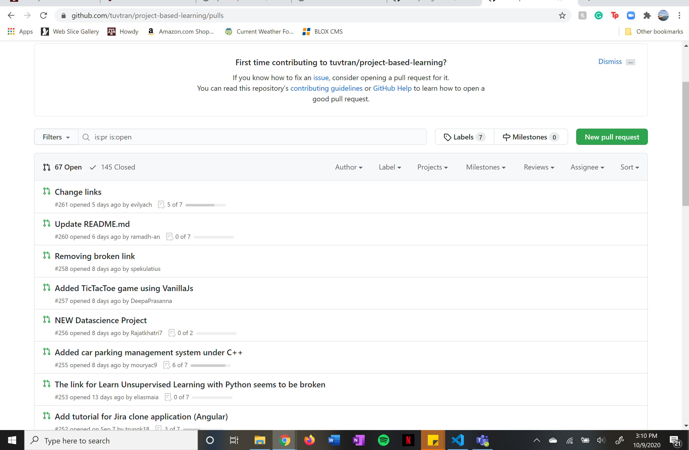

## Where are my files?

This week’s lesson provided with the much needed technique of what I would call "rough draft-ing" for my GitHub repository. I learned on the first day of class that the wait time for your blog to reload small incremental changes that, for the most part, don't do anything (see my last reflection for reference). Utilizing the branch feature to experiment on specific features provides me with the opportunity to mess up the code as much as possible and not have the consequences displayed to the world on my master branch. I also feel as though naming my commits will be much more useful in these smaller branches because I will not be sorting through hundreds of changes like on my master branch.

Now I am working on a test branch for this post! It does feel freeing to know that you can create and change code without the fear of completely ruining all the work you've put in so far. I spent to many hours trying to move my navigation bar to lose it now. 

Most importantly, I was able to fix my blog's issue of repeating the content! While it had previously repeated the title and copied all of my visible post beneath the new title, it is now simplified into one columne. Utilizing the history feature to search through my commits was a huge help in finding the repeated code. Now my blog looks more purposefully organized. 

I am also currently going through the process of cloning my page so that wait time completely diminishes, but it is still a work in progress. 

To find an example of this week's lesson, I choose to explore GitHub's repositories to see if there was anything I'd be interested in. Much of them required knowledge I'd imagine would take years to understand, I was able to find a category that was exclusively created to help new coders learn. Within that category I found a [project based learning](https://github.com/tuvtran/project-based-learning#readme) blog that helps coder learn through active projects. You could even learn how to build [Space Invaders](https://github.com/tuvtran/project-based-learning#cc) from scratch! The page is endless, with projects ranging from [building a chat room](https://github.com/tuvtran/project-based-learning#erlang) to [building your own bots](https://github.com/tuvtran/project-based-learning#bots) (which is somewhat terrifying). 

I went to the pull requests page and saw how the 64 collaborators built this instructional manuel together and how they communicated changes to each other. Contributors were fixing links and adding new projects weekly, despite the fact that the initial creation of the blog was two years ago. It was really amazing to see how they came together to create and innovate a repository like this just to help others learn.

This week left me feeling much more inspired to dive deeper into the coding world. While it is still incredibly overwhelming, it is amazing to see the amount of resources available that can really get you through the worst site break. Going forward, I hope to explore more GitHub pages and find new resources so I can try out new features and expand my understanding of coding as a whole. 
